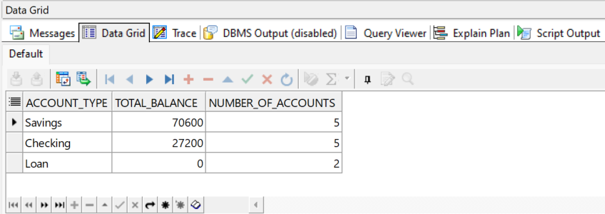
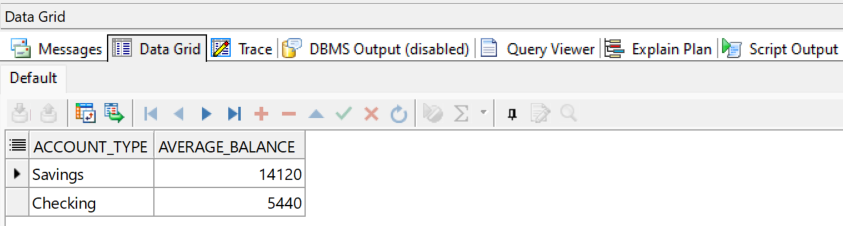
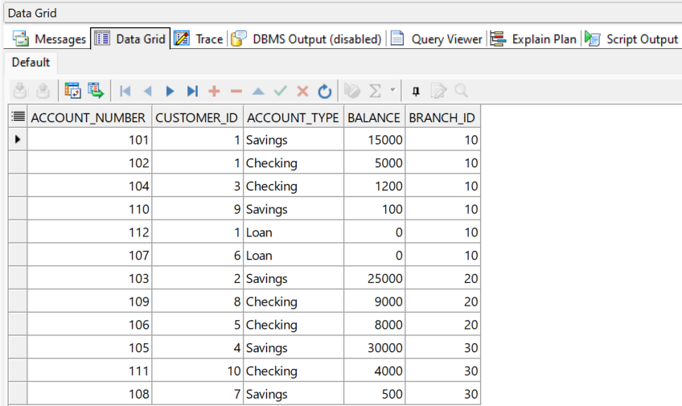

# Module 1: Solutions

### Exercise 1: Using GROUP BY to Aggregate Data - Solution

```
SELECT
    account_type,
    SUM(balance) AS total_balance,
    COUNT(account_number) AS number_of_accounts
FROM Bank_Accounts
GROUP BY account_type;
```



#### Explanation: 

The `GROUP BY account_type` clause organizes the rows into groups based on the unique values in the `account_type` column. The aggregate functions `SUM()` and `COUNT()` then operate on each of these groups, calculating the total balance and the number of accounts for 'Savings', 'Checking', and 'Loan' account types, respectively.

### Exercise 2: Filtering Aggregated Results with HAVING - Solution

```
SELECT
    account_type,
    AVG(balance) AS average_balance
FROM Bank_Accounts
GROUP BY account_type
HAVING AVG(balance) > 5000;
```



#### Explanation: 

`HAVING` is used because the condition `(AVG(balance) > 5000)` is applied to the results of the `GROUP BY` clause. The `WHERE` clause is used to filter individual rows before they are grouped. Since we are filtering based on an aggregate function `(AVG)`, `HAVING` is the correct clause to use.

### Exercise 3: Applying Complex ORDER BY Operations - Solution

```
SELECT *
FROM Bank_Accounts
ORDER BY branch_id ASC, balance DESC;
```



#### Explanation: 

This query first sorts all rows by `branch_id` in ascending order (which is the default, but `ASC` is good for clarity). For any rows that have the same `branch_id`, it then applies a secondary sort, ordering those rows by `balance` in descending order.