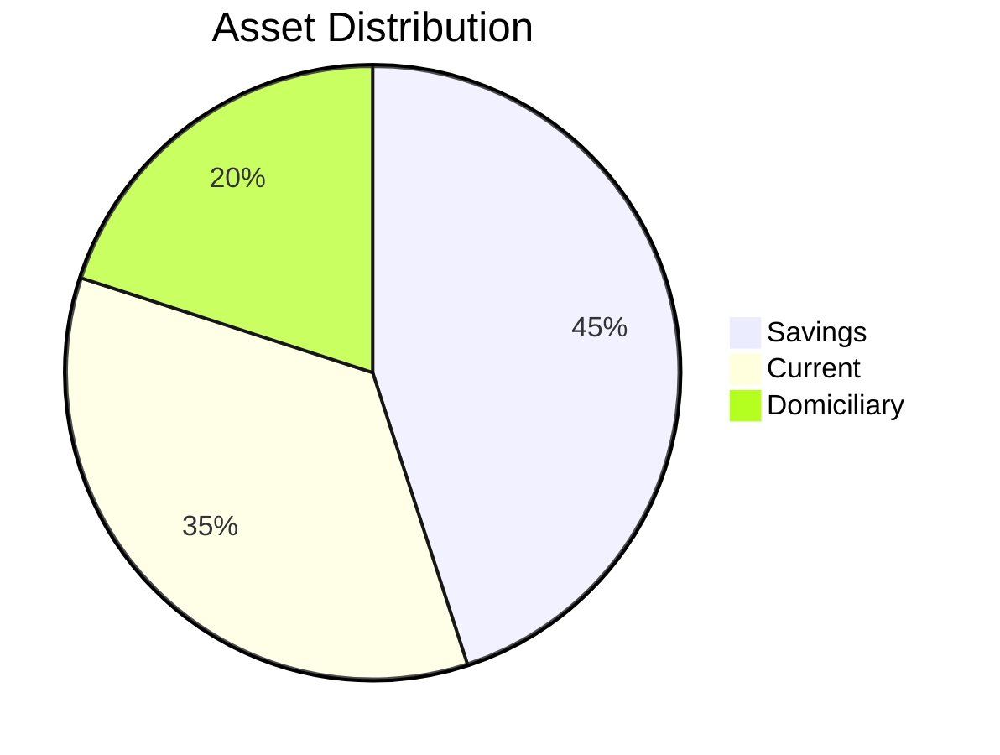

# Module 1: Overview of SQL and Oracle Database

## Learning Outcomes
- Understand relational databases through banking scenarios
- Explain SQL's role in financial data analysis
- Describe Oracle architecture in bank infrastructure contexts

---

## Relational Database Concepts 
```
CREATE TABLE fcmb_accounts (
    account_no VARCHAR2(10) PRIMARY KEY,
    customer_id NUMBER REFERENCES fcmb_customers,
    account_type VARCHAR2(20) CHECK (account_type IN ('SAVINGS','CURRENT','DOMICILIARY'));

```
## Lab: High-Value Customer Analysis

### Business Scenario
Identify priority customers across FCMB branches for:
- Targeted wealth management
- Product optimization
- RM allocation

### Step 1: Aggregate Balances
```sql
SELECT 
    branch_id,
    account_type,
    SUM(balance) AS total_assets
FROM fcmb_accounts
WHERE status = 'ACTIVE'
GROUP BY branch_id, account_type;
```

### Step 2: Filter VIP Segments
```sql
SELECT 
    customer_id,
    branch_id,
    total_balance
FROM (
    SELECT 
        customer_id,
        branch_id,
        SUM(balance) AS total_balance,
        RANK() OVER(PARTITION BY branch_id ORDER BY SUM(balance) DESC) AS cust_rank
    FROM fcmb_accounts
    GROUP BY customer_id, branch_id
) 
WHERE cust_rank <= 10;  -- Top 10 per branch
```

### Business Impact

