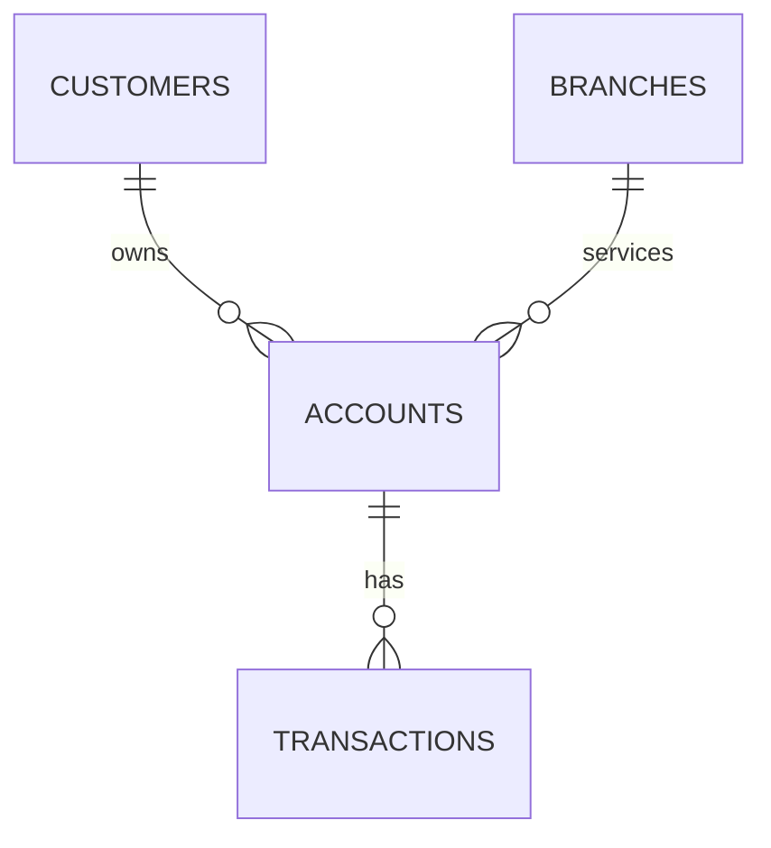

# Module 1: Overview of SQL and Oracle Database

## Learning Outcomes
- Design compliant banking database schemas  
- Implement CBN-mandated account structures  
- Optimize Oracle storage for financial data  

---

## Relational Database Concepts (FCMB Implementation)

### Core Banking Tables

---

## Lab: Account Status Audit

### Business Scenario
Identify accounts requiring:
- Dormancy marking (no activity for 12+ months)  
- BVN validation review  
- Digital onboarding completion  

```sql
SELECT 
    a.account_no,
    c.first_name || ' ' || c.last_name AS customer_name,
    a.balance,
    CASE 
        WHEN a.last_activity_date < ADD_MONTHS(SYSDATE, -12) THEN 'MARK_DORMANT'
        WHEN c.kyc_verified = 'N' THEN 'VERIFY_BVN'
        WHEN a.mobile_app_enabled = 'N' THEN 'DIGITAL_ONBOARDING'
        ELSE 'NO_ACTION'
    END AS required_action
FROM fcmb_accounts a
JOIN fcmb_customers c ON a.customer_id = c.customer_id
WHERE a.status = 'ACTIVE';
```

---

## Key Takeaways
| Concept | FCMB Implementation |
|---------|---------------------|
| Data Integrity | `CHECK` constraints for balances/status |
| Performance | Branch-based partitioning |
| Compliance | Full transaction audit trail |
| Scalability | Tablespace segregation |

