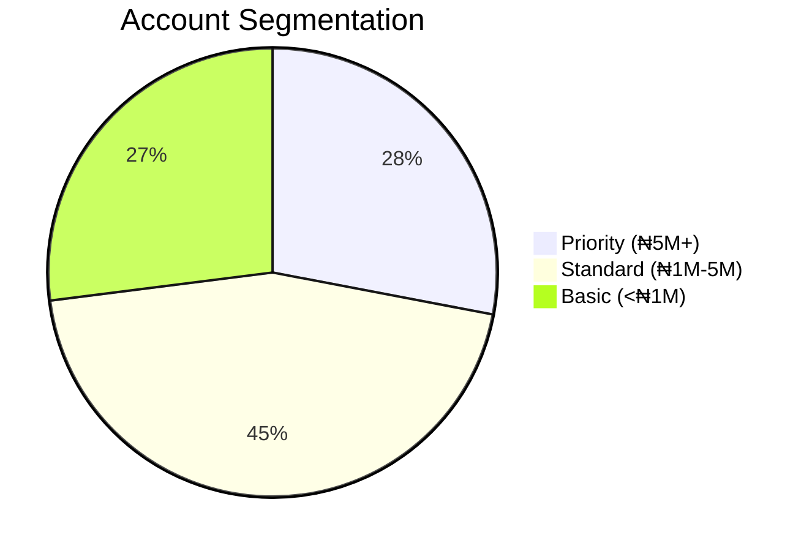

# Module 2: SQL Fundamentals for Banking Operations

## Learning Outcomes
- Retrieve and filter financial data using SELECT
- Implement proper data typing for banking systems
- Apply SQL best practices for audit compliance

---

## Lab: FCMB Customer Account Analysis

### Business Scenario
Conduct preliminary analysis to:
1. Review high-balance accounts
2. Generate customer statements
3. Identify data quality issues

---

## Exercise 1: Basic Account Queries

### Retrieve All Active Accounts
```sql
SELECT 
    account_no AS "Account Number",
    account_type AS "Product Type",
    balance/100 AS "Balance (₦'000)"  -- Convert kobos to naira
FROM fcmb_accounts
WHERE status = 'ACTIVE';
```

**Key Syntax Rules**:
- Always qualify currency amounts
- Use AS for column aliases with spaces
- Filter active records first

---

## Exercise 2: Data Type Implementation

### Banking Data Types Table
| Data Type | Banking Use | Example Column |
|-----------|------------|----------------|
| `VARCHAR2` | Customer names | `customer_name VARCHAR2(100)` |
| `NUMBER` | Account balances | `balance NUMBER(15,2)` |
| `DATE` | Transaction dates | `txn_date DATE` |
| `CLOB` | Customer memos | `kyc_notes CLOB` |

### Account Table Creation
```sql
CREATE TABLE fcmb_accounts (
    account_no VARCHAR2(10) PRIMARY KEY,  -- NUBAN format
    customer_id NUMBER NOT NULL,
    account_type VARCHAR2(20) CHECK (account_type IN ('SAVINGS','CURRENT','DOMICILIARY')),
    balance NUMBER(15,2) DEFAULT 0.00,
    open_date DATE DEFAULT SYSDATE,
    CONSTRAINT fk_customer FOREIGN KEY (customer_id) REFERENCES fcmb_customers
) TABLESPACE fcmb_data;
```

---

## Exercise 3: Advanced Filtering

### High-Value Customers
```sql
SELECT 
    c.customer_name,
    a.account_no,
    a.balance,
    CASE 
        WHEN a.balance >= 5000000 THEN 'Priority'
        WHEN a.balance >= 1000000 THEN 'Standard'
        ELSE 'Basic'
    END AS customer_segment
FROM fcmb_customers c
JOIN fcmb_accounts a ON c.customer_id = a.customer_id
WHERE a.account_type = 'SAVINGS'
  AND a.balance > 0
ORDER BY a.balance DESC;
```

**Best Practices**:
1. Use explicit JOINs instead of WHERE joins
2. Always include ORDER BY for financial reports
3. Document segment thresholds in comments

---

## Business Application

### Sample Output
| Customer Name | Account No | Balance (₦) | Segment |
|---------------|------------|-------------|---------|
| Adeola Johnson | 1234567890 | 12,450,000 | Priority |
| Chinedu Okoro | 9876543210 | 8,200,000 | Priority |

### Impact Analysis


---

## Key Takeaways
1. **Precision Matters**:  
   - Use `NUMBER(15,2)` for monetary values  
   - Always specify scale/precision

2. **Readability**:  
   ```sql
   -- Good
   SELECT account_no, balance FROM accounts;
   
   -- Avoid
   SELECT * FROM accounts;
   ```

3. **Compliance**:  
   - Alias sensitive columns (e.g., `AS "Masked BVN"`)  
   - Include audit filters (`WHERE is_audited = 'Y'`)

