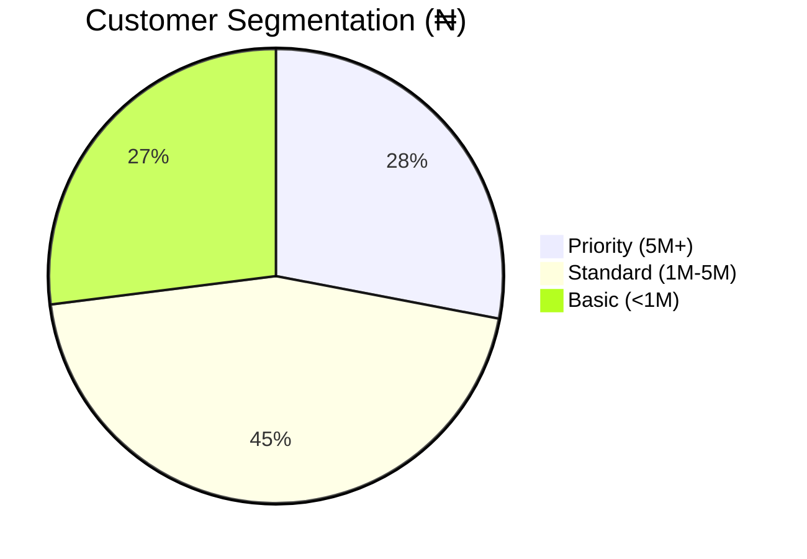

# Module 2: SQL Fundamentals for Banking Operations

## Learning Outcomes
- Retrieve and filter financial data using SELECT
- Implement proper data typing for banking systems
- Apply SQL best practices for audit compliance

---

## Lab: FCMB Customer Account Analysis

### Business Scenario
Conduct preliminary analysis to:
1. Review high-balance accounts
2. Generate customer statements
3. Identify data quality issues

---

## Exercise 1: Basic Account Queries

### Retrieve All Active Accounts
```sql
SELECT 
    account_no AS "Account Number",
    account_type AS "Product Type",
    balance/100 AS "Balance (₦'000)"  -- Convert kobos to naira
FROM fcmb_accounts
WHERE status = 'ACTIVE';
```

**Key Syntax Rules**:
- Always qualify currency amounts
- Use AS for column aliases with spaces
- Filter active records first

---

## Exercise 2: Data Type Exploration

### Banking Data Types in Practice
```sql
-- View column data types
SELECT 
    column_name,
    data_type,
    data_length,
    data_precision,
    data_scale
FROM all_tab_columns
WHERE table_name = 'FCMB_ACCOUNTS';
```

**Expected Output**:
| COLUMN_NAME | DATA_TYPE | DATA_LENGTH | DATA_PRECISION | DATA_SCALE |
|-------------|-----------|-------------|----------------|------------|
| ACCOUNT_NO | VARCHAR2 | 10 | null | null |
| BALANCE | NUMBER | null | 15 | 2 |
| OPEN_DATE | DATE | null | null | null |

---

## Exercise 3: Advanced Filtering

### High-Value Customers
```sql
SELECT 
    c.first_name || ' ' || c.last_name AS customer_name,
    a.account_no,
    TO_CHAR(a.balance, 'L999,999,999.00') AS formatted_balance,
    CASE 
        WHEN a.balance >= 5000000 THEN 'Priority'
        WHEN a.balance >= 1000000 THEN 'Standard' 
        ELSE 'Basic'
    END AS customer_segment,
    b.branch_name
FROM fcmb_customers c
JOIN fcmb_accounts a ON c.customer_id = a.customer_id
JOIN fcmb_branches b ON a.branch_code = b.branch_code
WHERE a.status = 'ACTIVE'
  AND a.last_activity_date > ADD_MONTHS(SYSDATE, -6)
ORDER BY a.balance DESC;
```

**Best Practices**:
1. Use explicit JOINs for clarity
2. Format currency for readability
3. Include branch information for context

---

## Business Application

### Sample Output
| CUSTOMER_NAME | ACCOUNT_NO | FORMATTED_BALANCE | SEGMENT | BRANCH_NAME |
|---------------|------------|-------------------|---------|-------------|
| Adeola Johnson | 1234567890 | ₦12,450,000.00 | Priority | Lagos Main |
| Chinedu Okoro | 9876543210 | ₦8,200,000.00 | Priority | Abuja Central |

### Impact Analysis


---

## Key Takeaways
1. **Data Discovery**:
   ```sql
   -- View table structure
   DESC fcmb_accounts;
   
   -- Check constraints
   SELECT constraint_name, constraint_type 
   FROM all_constraints
   WHERE table_name = 'FCMB_ACCOUNTS';
   ```

2. **Secure Formatting**:
   ```sql
   -- Mask sensitive data
   SELECT 
       SUBSTR(account_no, 1, 3) || '****' || SUBSTR(account_no, -3) AS masked_account,
       REGEXP_REPLACE(bvn, '(\d{3})\d{4}(\d{4})', '\1****\2') AS masked_bvn
   FROM fcmb_customers;
   ```

3. **Performance**:
   ```sql
   -- Explain plan for optimization
   EXPLAIN PLAN FOR
   SELECT * FROM fcmb_accounts WHERE branch_code = 'LAG01';
   SELECT * FROM TABLE(DBMS_XPLAN.DISPLAY);
   ```
