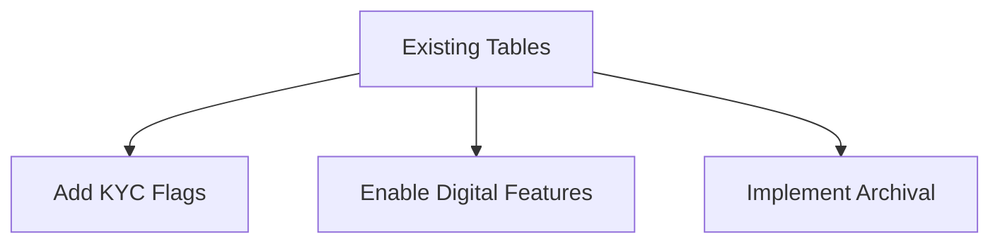

# Module 3: Banking Database Schema Management

## Learning Outcomes
- Modify existing banking tables for compliance  
- Implement advanced constraints  
- Manage customer data lifecycle  

---

## Lab: FCMB Customer Data Management

### Business Scenario  
Enhance the existing system to:  
1. Track additional KYC documentation  
2. Support digital banking features  
3. Implement CBN-mandated data retention  

---

## Exercise 1: KYC System Enhancement

### Verify Existing Structure
```sql
-- Check current customer table
SELECT column_name, data_type, nullable 
FROM all_tab_columns 
WHERE table_name = 'FCMB_CUSTOMERS';

-- Review existing constraints
SELECT constraint_name, constraint_type, search_condition
FROM all_constraints
WHERE table_name = 'FCMB_CUSTOMERS';
```

### Add KYC Tracking Columns
```sql
ALTER TABLE fcmb_customers ADD (
    id_verified CHAR(1) DEFAULT 'N' CHECK (id_verified IN ('Y','N')),
    utility_verified CHAR(1) DEFAULT 'N',
    verification_date DATE
);

COMMENT ON COLUMN fcmb_customers.id_verified IS 'CBN requirement for Tier 3 accounts';
```

---

## Exercise 2: Digital Banking Upgrade

### Modify Accounts Table
```sql
-- Check current digital banking features
SELECT mobile_app_enabled, ussd_pin 
FROM fcmb_accounts 
WHERE ROWNUM < 5;

-- Add new digital features
ALTER TABLE fcmb_accounts ADD (
    biometric_auth CHAR(1) DEFAULT 'N' CHECK (biometric_auth IN ('Y','N')),
    last_mobile_login DATE
);

-- Update existing records
UPDATE fcmb_accounts 
SET mobile_app_enabled = 'Y'
WHERE account_type IN ('SAVINGS','CURRENT') 
AND open_date > ADD_MONTHS(SYSDATE, -6);
```

---

## Exercise 3: Data Lifecycle Management

### Archive Inactive Customers
```sql
-- Create temporary reporting table
CREATE GLOBAL TEMPORARY TABLE temp_inactive_customers (
    customer_id NUMBER,
    last_activity_date DATE
) ON COMMIT PRESERVE ROWS;

-- Identify candidates
INSERT INTO temp_inactive_customers
SELECT 
    c.customer_id,
    MAX(a.last_activity_date) AS last_activity
FROM fcmb_customers c
JOIN fcmb_accounts a ON c.customer_id = a.customer_id
GROUP BY c.customer_id
HAVING MAX(a.last_activity_date) < ADD_MONTHS(SYSDATE, 24);

-- Review before archiving
SELECT COUNT(*) AS inactive_customers FROM temp_inactive_customers;

-- Execute archival (with audit)
BEGIN
  INSERT INTO fcmb_audit_log
  SELECT 
      customer_id, 
      'ARCHIVAL', 
      'Customer marked inactive', 
      SYSDATE 
  FROM temp_inactive_customers;
  
  UPDATE fcmb_customers
  SET status = 'INACTIVE'
  WHERE customer_id IN (SELECT customer_id FROM temp_inactive_customers);
  
  COMMIT;
END;
```

---

## Key Takeaways  
| Concept | Banking Implementation |  
|---------|------------------------|  
| Schema Evolution | Added biometric authentication tracking |  
| Data Governance | Compliant archival process with audit trail |  
| Regulatory Alignment | CBN verification requirements |  



