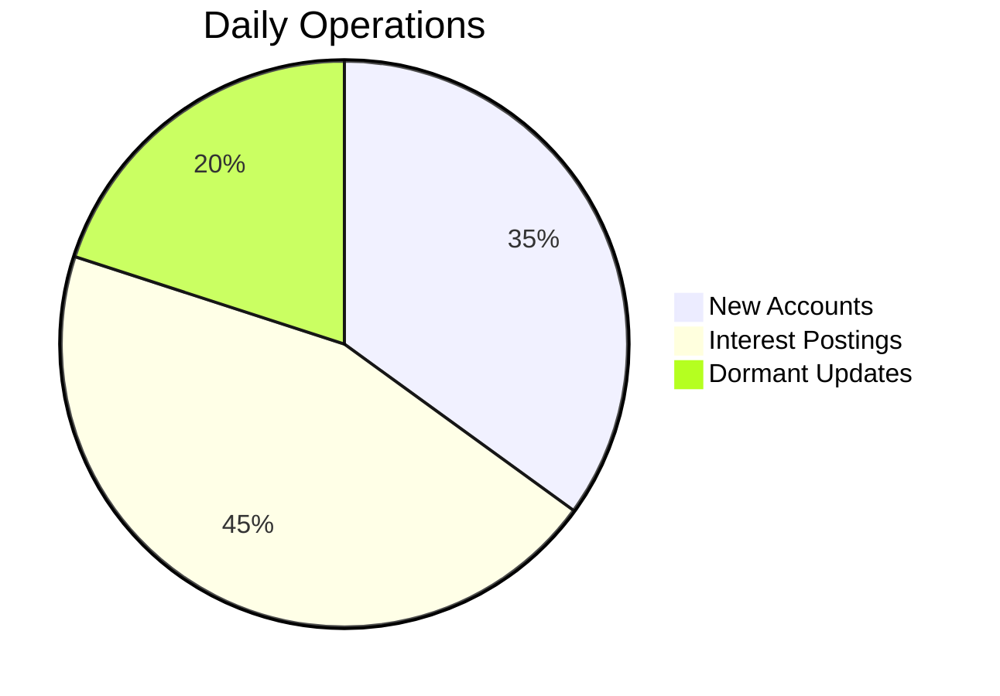

# Module 4 - Banking Transaction Processing

## Learning Outcomes  
- Process customer transactions securely  
- Maintain audit trails for compliance  
- Implement bulk data operations  

---

## Lab: FCMB End-of-Day Processing

### Business Scenario  
Automate:  
1. Bulk customer onboarding  
2. Daily interest accrual  
3. Dormant account management  

---

### Exercise 1: Bulk Customer Onboarding  
```sql
-- Multi-row insert for new branches
INSERT ALL
  INTO fcmb_customers VALUES (1001, '22345678901', 'Adeola Johnson', 'PREMIUM')
  INTO fcmb_customers VALUES (1002, '22345678902', 'Chioma Eze', 'BASIC')
  INTO fcmb_accounts VALUES ('0012345678', 1001, 'SAVINGS', SYSDATE)
SELECT 1 FROM dual;

-- Subquery insert for account linking
INSERT INTO customer_kyc (doc_id, customer_id, doc_type)
SELECT doc_seq.NEXTVAL, customer_id, 'ID' 
FROM fcmb_customers 
WHERE tier_level = 'PREMIUM';
```

---

### Exercise 2: Interest Accrual  
```sql
-- Savings interest calculation
UPDATE fcmb_accounts 
SET balance = balance * (1 + (
    CASE 
        WHEN account_type = 'SAVINGS' THEN 0.045/365  -- 4.5% annual
        WHEN account_type = 'DOMICILIARY' THEN 0.02/365 
        ELSE 0 
    END))
WHERE status = 'ACTIVE';

-- Audit trail
INSERT INTO transaction_log 
SELECT 
    account_no, 
    'INTEREST', 
    balance * 0.045/365, 
    SYSDATE 
FROM fcmb_accounts 
WHERE account_type = 'SAVINGS';
```

---

### Exercise 3: Dormant Account Handling  
```sql
-- Mark dormant accounts
UPDATE fcmb_accounts 
SET status = 'DORMANT',
    last_review_date = SYSDATE
WHERE last_activity_date < ADD_MONTHS(SYSDATE, 12);

-- Notify customers (using transaction)
BEGIN
  INSERT INTO customer_notifications
  SELECT 
      customer_id, 
      'ACCOUNT_DORMANT', 
      'Your account will be archived', 
      SYSDATE 
  FROM fcmb_accounts 
  WHERE status = 'DORMANT';
  
  COMMIT;
EXCEPTION
  WHEN OTHERS THEN 
    ROLLBACK;
    DBMS_OUTPUT.PUT_LINE('Error: '||SQLERRM);
END;
```

---

## Business Impact  


## Key Controls  
1. Always use transactions for financial updates  
2. Maintain before/after snapshots for critical operations  
3. Validate data with `CHECK` constraints  


