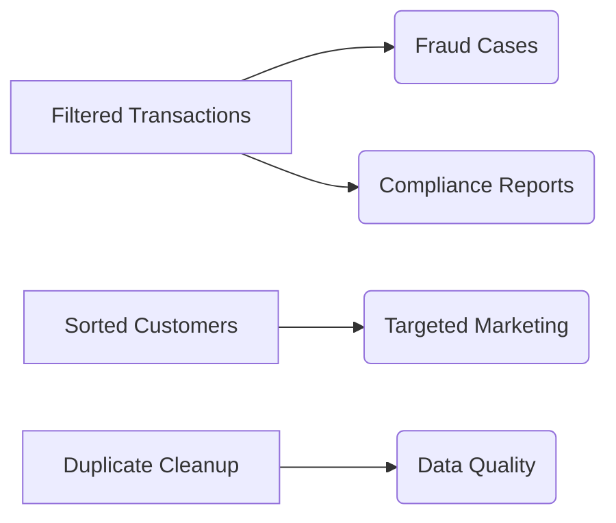

# Module 5 - Targeted Customer Data Analysis

## Learning Outcomes
- Filter transaction records for compliance  
- Sort customer data for priority servicing  
- Optimize query performance for large datasets  

---

## Lab: FCMB Customer Segmentation

### Business Scenario  
Identify:  
1. High-risk transactions for fraud monitoring  
2. Priority customers for holiday promotions  
3. Duplicate account records needing cleanup  

---

### Exercise 1: Transaction Filtering  
```sql
-- Suspicious transactions (multiple operators)
SELECT 
    txn_id,
    account_no,
    amount,
    txn_date
FROM fcmb_transactions
WHERE amount > 1000000
  AND txn_time BETWEEN '22:00' AND '04:00'
  AND beneficiary NOT IN ('FCMB-INTERNAL','PAYROLL')
  AND description LIKE '%CRYPTO%'
ORDER BY amount DESC;
```

**Key Filters**:  
- `>` for amount thresholds  
- `BETWEEN` for time windows  
- `NOT IN` for exclusion lists  
- `LIKE` for pattern matching  

---

### Exercise 2: Customer Ranking  
```sql
-- Top customers by product type
SELECT 
    c.customer_name,
    a.account_no,
    a.balance,
    RANK() OVER (PARTITION BY a.account_type 
                 ORDER BY a.balance DESC) AS wealth_rank
FROM fcmb_customers c
JOIN fcmb_accounts a ON c.customer_id = a.customer_id
WHERE a.status = 'ACTIVE'
  AND a.balance >= 500000
ORDER BY 
    a.account_type,
    wealth_rank;
```

**Sorting Logic**:  
1. Primary: Account type (Savings → Current → Domiciliary)  
2. Secondary: Balance (Highest first)  

---

### Exercise 3: Duplicate Detection  
```sql
-- Find potential duplicate customers
SELECT DISTINCT
    UPPER(TRIM(first_name)) AS first_name,
    UPPER(TRIM(last_name)) AS last_name,
    COUNT(*) AS record_count
FROM fcmb_customers
GROUP BY 
    UPPER(TRIM(first_name)),
    UPPER(TRIM(last_name))
HAVING COUNT(*) > 1;
```

**Performance Tip**:  
Create function-based index for frequent searches:  
```sql
CREATE INDEX idx_cust_name_clean ON fcmb_customers(
    UPPER(TRIM(first_name)),
    UPPER(TRIM(last_name))
);
```

---

## Business Impact  



---

